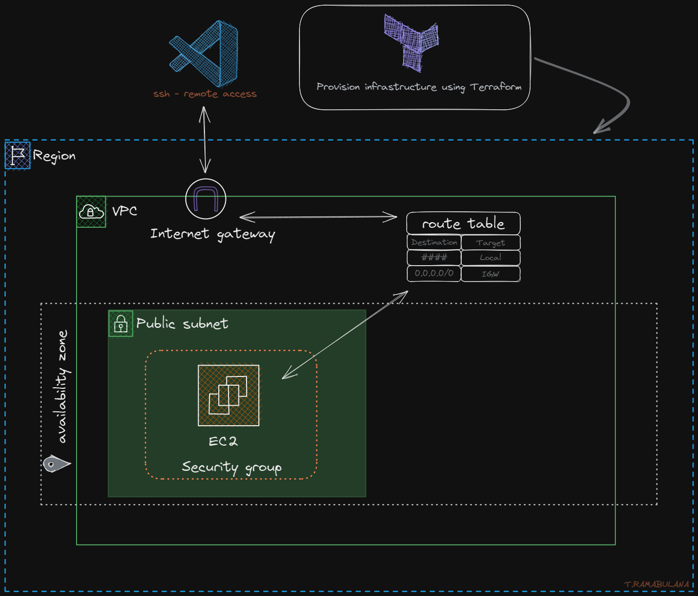

# Building a Dev Environment on AWS Using Terraform
This guide will walk you through the process of using Terraform to create an AWS environment for developers to work in. The environment will be isolated within a VPC and accessible through VS Code using the Remote SSH extension.

## Architecture:

## Prerequisites
Before you begin, make sure you have the following:

* An AWS account
* An IAM user with the necessary permissions for Terraform
* Terraform installed on your local machine
* Your AWS credentials configured as environment variables on your local machine

## Most used commands
``terraform plan``

## Steps
1. **Create a VPC and public subnet:** Use Terraform to create a VPC with a public subnet to isolate your environment from the internet.

2. **Create an internet gateway:** Define an internet gateway to allow your VPC to communicate with the internet.

3. **Define a route table:** Create a route table for your public subnet to specify how traffic should be routed to the internet gateway.

4. **Create a security group:** Define a security group to control traffic in and out of your EC2 instance.

5. **Create an EC2 instance:** Use an AMI datasource to find the latest Ubuntu 20.04 LTS AMI for your EC2 instance, define an SSH key pair for secure access to your EC2 instance, and create a userdata script to install any necessary packages during startup.

6. **Configure the EC2 instance:** Use Terraform's provisioner and templatefile to create a configuration file for your EC2 instance, and create SSH configuration scripts to simplify the connection process and make it easier to SSH into the instance.

7. **Parameterize the configuration:** Use Terraform's variable feature to parameterize your configuration to make it reusable.

8. **Use conditional expressions:** Use conditional expressions to handle different scenarios, such as whether or not to include the SSH configuration scripts.

9. **Display the public IP address:** Use Terraform's output feature to display the public IP address of your EC2 instance after applying the configuration.

10. **Connect to the EC2 instance:** Use VS Code's Remote SSH extension to connect to your EC2 instance from your local machine.

## Conclusion
By following these steps, you can create a secure, isolated AWS environment for developers to work in, and make it easily accessible using VS Code's Remote SSH extension. Happy coding!# TerraformEnvSetup
